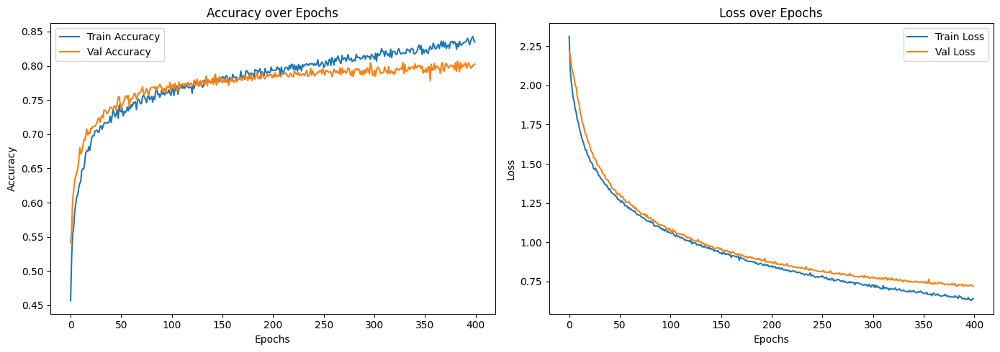

# Emotion Detection Using Voice 🎙️

## Description 

This project focuses on detecting human emotions using voice recordings. By leveraging machine learning and deep learning techniques, we analyze vocal features to classify emotions into categories like happy, sad, angry, neutral, etc.

## Installation

### Requirements
- Python 3  
- TensorFlow  
- Pandas  
- Other dependencies (see `requirements.txt` or `environment.yml`)  

To set up the environment, run:

#### Using Conda
```bash
conda env create -f Requirement/environment.yml
conda activate emotion-detection
```
#### Pip
```bash
pip install -r Requirement/requirements.txt 
```


## Dataset
In this project we're finding the emotion of a person by its vocal pattern. To achive this we are training our model with numerous dataset which contain voices of different actors. These are dataset we have:-
* CREMA-D ( Crowd-sourced Emotional Mutimodal Actors Dataset )
  https://www.kaggle.com/datasets/ejlok1/cremad
* RAVDESS ( Ryerson Audio-Visual Database of Emotional Speech and Song  )
    https://www.kaggle.com/datasets/uwrfkaggler/ravdess-emotional-speech-audio
* SAVEE( Surrey Audio-Visual Expressed Emotion )
  https://www.kaggle.com/datasets/ejlok1/surrey-audiovisual-expressed-emotion-savee
* TESS( Toronto emotional speech set )
  https://www.kaggle.com/datasets/ejlok1/toronto-emotional-speech-set-tess

`INFORMATION ABOUT DATASET WILL BE AVAILABLE FROM THE GIVEN LINKS`

## Features
✅ Preprocessing of audio data

✅ Feature extraction using MFCCs & other techniques

✅ Machine learning & deep learning models for emotion classification

✅ Performance evaluation & result analysis


## Data Preprocessing 


We have combined multiple dataset into a single dataframe with path and label. This was done directly within the dataset provided. What we did was get the required number of samples based on the number of emotions.The file after data preprocessing can be found in data. Note: It contains the path and labels, not the audio file. 


## Feature Extraction
Extract feature from audio file 
        
        Features supported:
            
            - MFCC (mfcc)
            - Chroma (chroma)
            - MEL Spectrogram Frequency (mel)
            - Contrast (contrast)
            - Tonnetz (tonnetz)

## Result
* We were able to achieve more than 78% accuracy with our simplified model.
 


We welcome contributions! Please create an issue or pull request if you'd like to contribute.
